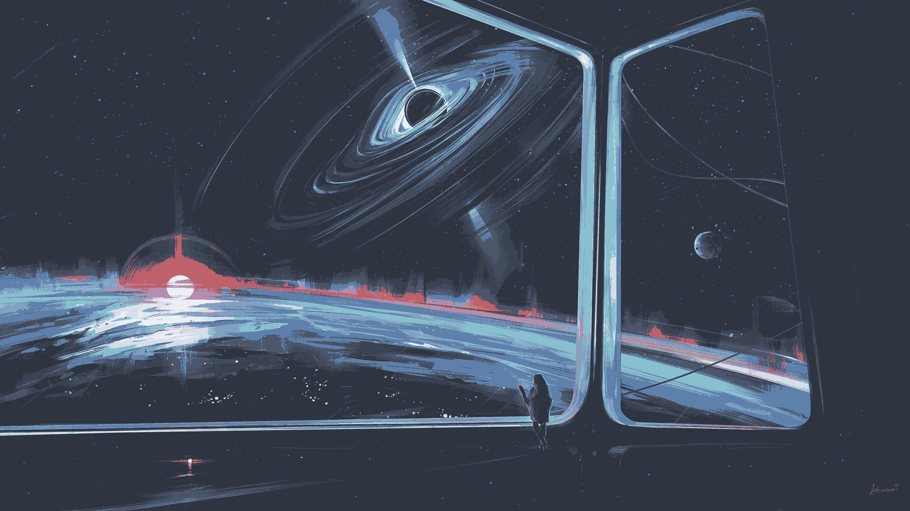

# Image to your Palette
## Instalação:
> Obs.: Programa feito e testado utilizando Arch Linux em conjunto com python3.10

- Para baixar o programa, pode-se utilizar o Git:
```
git clone https://github.com/M3L4O/2YourPalette.git
```

Dentro do diretório terá o requirements.txt, o qual serve para instalar as dependêcia ― de preferência em um ambiente virtual.
- Para instalá-las é apenas necessário o pip:
```
pip install -r requirements.txt
```

Pronto!!!

## Execução:
Para executar o programa, é necessário indicar o caminho, bem como o nome, do arquivo, mostrado no exemplo abaixo:
```
python toYourPalette.py <caminho até o arquivo + nome do arquivo>
python toYourPalette.py Imagens/window.png
```
Se quiser utilizar a sua própria paleta de cores, é necessário informar o arquivo onde essa paleta se encontra:
```
python twonord.py Imagens/window.jpg <nome do arquivo onde se encontra a paleta>
```

Um exemplo de paleta que o programa consegue utilizar:
gruvbox.txt
```
46 131 116
251 73 52
184 187 38
250 189 47
131 165 152
211 134 155
142 192 124
254 128 25
35 219 178
51 241 199
251 241 199
235 219 178
213 196 161
189 174 147
168 153 132
```
## Demonstração:
Imagem Original: 

Imagem modificada pelo programa:

