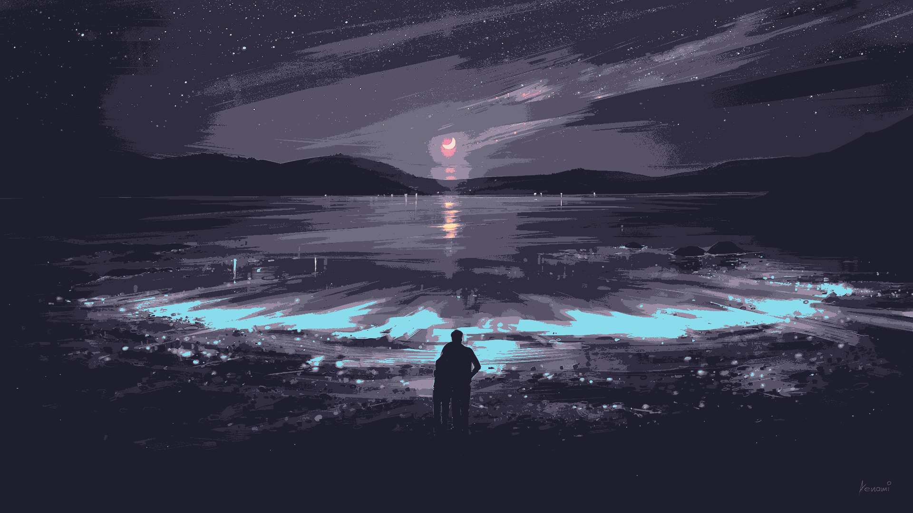

# Image to your Palette
## Instalação:
> Obs.: Programa feito e testado utilizando Arch Linux em conjunto com python3.10

- Para baixar o programa, pode-se utilizar o Git:
```
git clone https://github.com/M3L4O/2YourPalette.git
```

Dentro do diretório terá o requirements.txt, o qual serve para instalar as dependêcia ― de preferência em um ambiente virtual.
- Para instalá-las é apenas necessário o pip:
```
pip install -r requirements.txt
```

Pronto!!!

## Execução:
Para executar o programa, é necessário indicar o caminho, bem como o nome, do arquivo, juntamente à paleta desejada,como mostrado no exemplo abaixo:
```
python main.py <caminho até o arquivo + nome do arquivo> <nome do arquivo contendo a paleta>
python main.py images/window.jpg catppuccin
```

Um exemplo de paleta que o programa consegue utilizar:
catppuccin
```
245 224 220
242 205 205
221 182 242
245 194 231
232 162 175
242 143 173
248 189 150
250 227 176
171 233 179
181 232 224
150 205 251
137 220 235
201 203 255
30 30 46
48 45 65
87 82 104
110 108 126
152 139 162
195 186 198
217 224 238
```
## Demonstração:

### Imagem Original: 
<kbd></kbd>

### Imagem modificada pelo programa utilizando a paleta :
<kbd></kbd>

